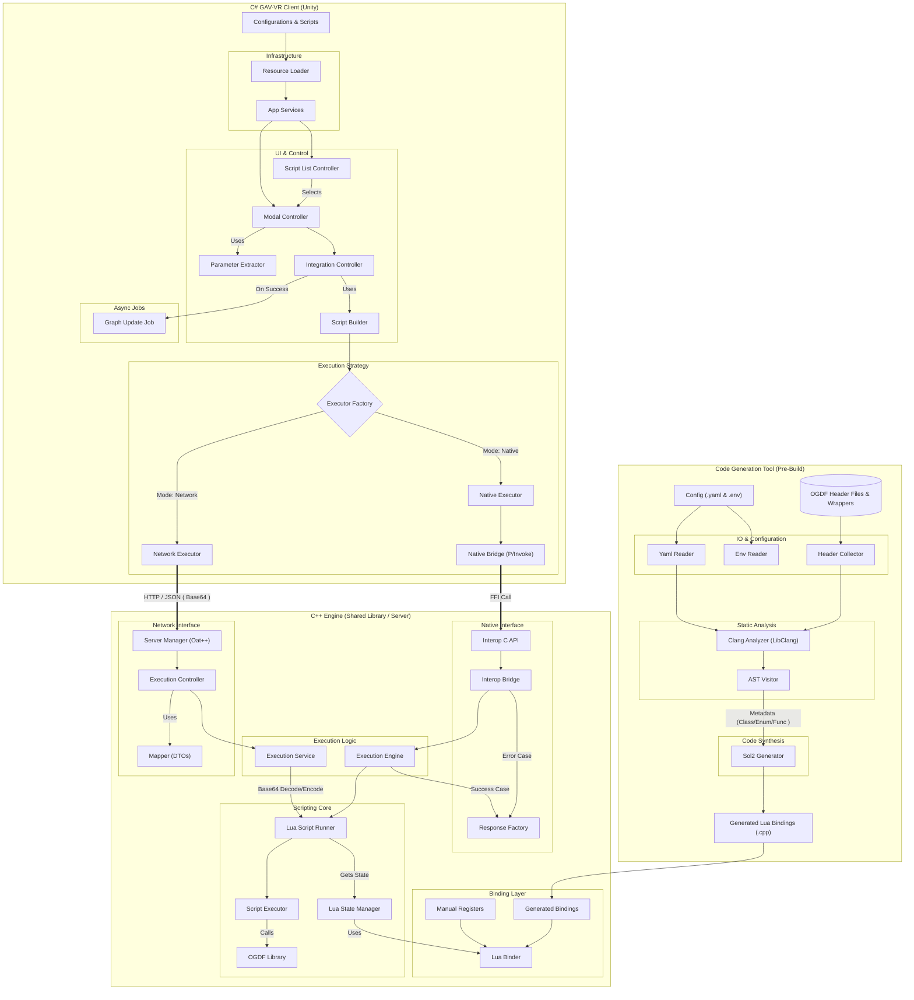

# BRIDGE (Binding Runtime Interface for Dynamic General Execution)

A resilient hybrid architecture and middleware connecting the **Open Graph Drawing Framework (OGDF)** to **Unity (GAV-VR)** via automated Lua bindings for high-performance immersive graph analysis.

## 📖 About

**BRIDGE** is a master thesis project designed to solve the "Technical Debt" and interoperability challenges between managed VR environments (C#/.NET) and high-performance native graph libraries (C++).

Visualizing complex networks in Virtual Reality often leads to "hairball" structures. While C++ libraries like **OGDF** offer powerful layout algorithms to resolve this, integrating them into Unity is notoriously difficult due to memory management conflicts and the manual effort required to wrap extensive APIs.

### Key Features

* **Hybrid Architecture:** Seamlessly bridges C# (Unity) and C++ (OGDF) using **Lua** as a lightweight intermediary layer.
* **Automated Binding Generation ("Codegen"):** Uses **LibClang** AST analysis to automatically generate type-safe C++ binding code for Lua, eliminating manual wrapper maintenance.
* **Dual Execution Strategy:**
    * **Native Mode:** Runs locally via P/Invoke for low-latency VR interactions.
    * **Network Mode:** Runs as a standalone microservice (REST API via **Oat++**) for offloading heavy computations to the cloud.
* **Safety & Security:** Implements a strict whitelist sandbox and thread-local state management to ensure memory safety and concurrency.

### System Architecture

The following diagram illustrates the data flow across the Code Generation Tool, the BRIDGE Engine, and the Client.



## 🚀 Installation

### Prerequisites

* **C++ Compiler:** GCC 13.3.0+ or MSVC (C++17 support required).
* **Build System:** CMake (3.28+), Ninja.
* **Dependencies:** Lua 5.4, OGDF (Elderberry), Oat++, Sol2, LibClang.

### Setup Steps

1.  **Clone the Repository**
    ```bash
    git clone https://github.com/orkhanigidov/BRIDGE.git
    cd BRIDGE
    ```
2.  **Environment Configuration**
    Copy the example environment file and configure your paths (specifically `LIBRARY_INCLUDE_PATH` for OGDF headers).
    ```bash
    cp .env.example .env
    ```
3.  **Build the Engine**
    Use the provided bootstrap scripts to install dependencies and compile.
    ```powershell
    # Windows (PowerShell)
    # Builds as a Shared Library (DLL) for Unity Local Execution
    ./bootstrap.ps1 -BuildType Release -InstallDeps --build-shared
    ```
    ```bash
    # Linux (Bash)
    # Builds as a Standalone Server for Cloud Execution
    chmod +x bootstrap.sh
    sudo ./bootstrap.sh --build-type Release --install-deps
    ```

## 💻 Usage

The BRIDGE Engine can operate in two modes depending on your compilation target.

### 1. Configuration (Bindings)

Before building, define which OGDF classes and methods to expose to Lua in `bindings_config.yaml`:

```yaml
classes:
  - name: Graph
    methods:
      - numberOfNodes
  - name: SugiyamaLayout
free_functions:
  - randomSimpleGraph
```

### 2. Execution Modes

* **A. Native Mode (Unity P/Invoke)**
  If built with `--build-shared`, the output is `Engine.dll`.
  * The build script automatically copies `Engine.dll` and `lua54.dll` to your Unity project's `Assets/Plugins/` folder (if `UNITY_PROJECT_PATH` is set in `.env`).
  * In GAV-VR options, select **"Native"**.
 
* **B. Network Mode (Cloud/Server)**
  If built without the shared flag, the output is an executable (`Engine` or `Engine.exe`).
  * Run the server:
  ```bash
  ./build/Engine --host 0.0.0.0 --port 8000
  ```
  * In GAV-VR options, select **"Network"** and configure `NetworkConfiguration.json`:
  ```json
  {
      "protocol": "http",
      "host": "localhost",
      "port": 8000,
      "endpoint": "/api/execute_script"
  }
  ```

### 3. Scripting Example

Write Lua scripts to control C++ algorithms dynamically. Files are placed in the `Scripts/` directory.

**Example: Hierarchical Layout (`hierarchical.lua`)**

```lua
-- 'GA' (GraphAttributes) and 'G' (Graph) are injected by the Engine
read(GA, G, __input__) -- __input__ is auto-replaced by the Engine

sl = SugiyamaLayout()
sl:setRanking(OptimalRanking())
sl:setCrossMin(MedianHeuristic())

ohl = OptimalHierarchyLayout()
ohl:layerDistance(30.0)
ohl:nodeDistance(25.0)

sl:setLayout(ohl)
sl:call(GA) -- Executes C++ OGDF code

write(GA, __output__) -- __output__ is handled by the Engine
```

## 📄 License

This project is licensed under the **GNU Affero General Public License v3.0 (AGPL-3.0)**. See the [LICENSE](https://github.com/orkhanigidov/BRIDGE/blob/with_sol2/LICENSE) file for details.

* **Copyright:** © 2025 Orkhan Igidov
* **Thesis Context:** Connecting OGDF to GAV-VR - Design Concept and Realisation (Universität Konstanz).
