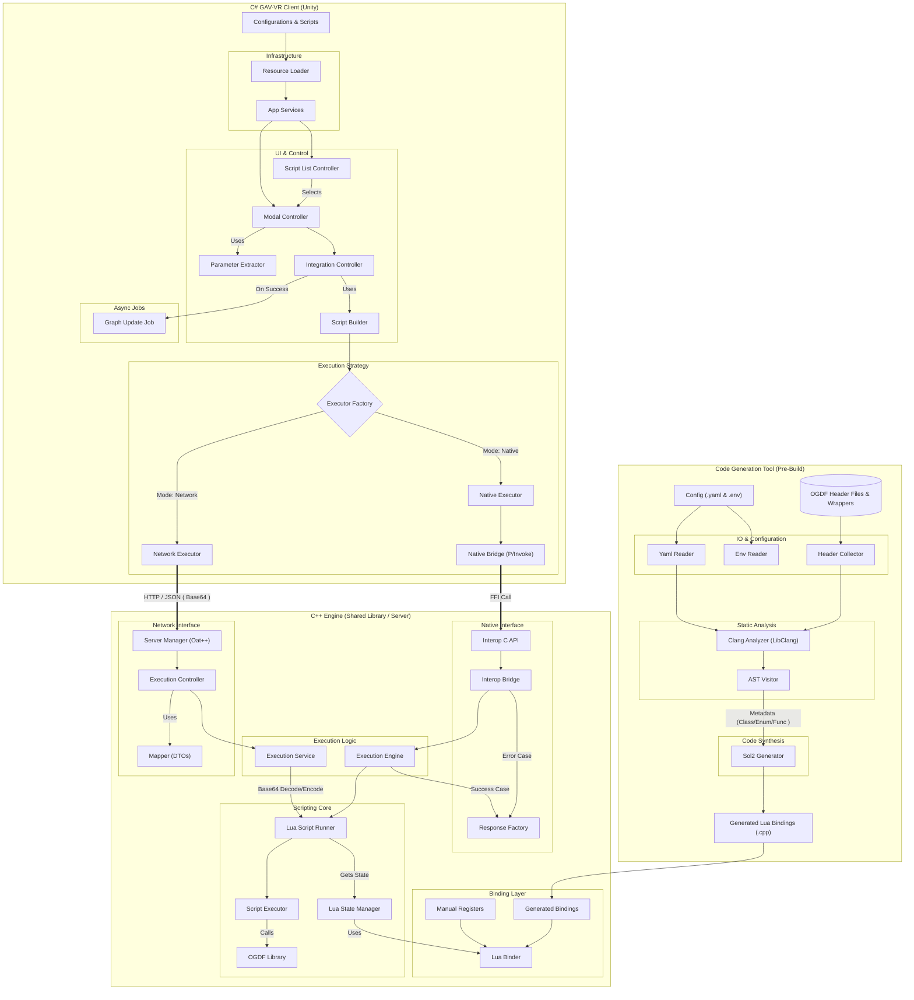

# Engine

```mermaid
flowchart TB
    subgraph IO_Parsers["IO &amp; Configuration"]
        EnvReader["Env Reader"]
        YamlReader["Yaml Reader"]
        HeaderCollector["Header Collector"]
    end
    subgraph Analysis["Static Analysis"]
        ClangAnalyzer["Clang Analyzer (LibClang)"]
        AstVisitor["AST Visitor"]
    end
    subgraph Generation["Code Synthesis"]
        Sol2Generator["Sol2 Generator"]
    end
    subgraph Codegen["Code Generation Tool (Pre-Build)"]
        ConfigFile["Config (.yaml & .env)"]
        InputFiles[("OGDF Header Files & Wrappers")]
        IO_Parsers
        Analysis
        Generation
        GeneratedBindings["Generated Lua Bindings (.cpp)"]
    end
    subgraph Binding_Layer["Binding Layer"]
        LuaBinder["Lua Binder"]
        ManualRegisters["Manual Registers"]
        GeneratedBindings_In["Generated Bindings"]
    end
    subgraph Scripting_Core["Scripting Core"]
        LuaStateManager["Lua State Manager"]
        ScriptExecutor["Script Executor"]
        LuaScriptRunner["Lua Script Runner"]
        OGDF["OGDF Library"]
    end
    subgraph Execution_Logic["Execution Logic"]
        ExecutionEngine["Execution Engine"]
        ExecutionService["Execution Service"]
    end
    subgraph Native_Interface["Native Interface"]
        InteropCAPI["Interop C API"]
        InteropBridge["Interop Bridge"]
        ResponseFactory["Response Factory"]
    end
    subgraph Network_Interface["Network Interface"]
        ServerManager["Server Manager (Oat++)"]
        ExecutionController["Execution Controller"]
        Mapper["Mapper (DTOs)"]
    end
    subgraph Engine["C++ Engine (Shared Library / Server)"]
        Binding_Layer
        Scripting_Core
        Execution_Logic
        Native_Interface
        Network_Interface
    end
    subgraph Infrastructure["Infrastructure"]
        AppServices["App Services"]
        ResourceLoader["Resource Loader"]
    end
    subgraph UI_Control["UI & Control"]
        ScriptListController["Script List Controller"]
        IntegrationController["Integration Controller"]
        ModalController["Modal Controller"]
        ParameterExtractor["Parameter Extractor"]
        ScriptBuilder["Script Builder"]
    end
    subgraph Execution_Strategy["Execution Strategy"]
        ExecutorFactory{"Executor Factory"}
        NativeExecutor["Native Executor"]
        NetworkExecutor["Network Executor"]
        NativeBridge["Native Bridge (P/Invoke)"]
    end
    subgraph Async_Jobs["Async Jobs"]
        GraphUpdateJob["Graph Update Job"]
    end
    subgraph Client["C# GAV-VR Client (Unity)"]
        direction TB
        CSHConfig["Configurations &amp; Scripts"]
        Infrastructure
        UI_Control
        Execution_Strategy
        Async_Jobs
    end
    CSHConfig --> ResourceLoader
    InputFiles --> HeaderCollector
    ConfigFile --> EnvReader & YamlReader
    HeaderCollector --> ClangAnalyzer
    YamlReader --> ClangAnalyzer
    ClangAnalyzer --> AstVisitor
    AstVisitor -- Metadata (Class/Enum/Func ) --> Sol2Generator
Sol2Generator --> GeneratedBindings
GeneratedBindings --> GeneratedBindings_In
GeneratedBindings_In --> LuaBinder
ManualRegisters --> LuaBinder
LuaStateManager -- Uses --> LuaBinder
LuaScriptRunner -- Gets State --> LuaStateManager
LuaScriptRunner --> ScriptExecutor
ScriptExecutor -- Calls --> OGDF
InteropCAPI --> InteropBridge
InteropBridge -- Error Case --> ResponseFactory
ExecutionEngine -- Success Case --> ResponseFactory
InteropBridge --> ExecutionEngine
ExecutionEngine --> LuaScriptRunner
ServerManager --> ExecutionController
ExecutionController --> ExecutionService
ExecutionController -- Uses --> Mapper
ExecutionService -- Base64 Decode/Encode --> LuaScriptRunner
ResourceLoader --> AppServices
AppServices --> ScriptListController & ModalController
ScriptListController -- Selects --> ModalController
ModalController --> IntegrationController
ModalController -- Uses --> ParameterExtractor
IntegrationController -- Uses --> ScriptBuilder
ScriptBuilder --> ExecutorFactory
ExecutorFactory -- Mode: Native --> NativeExecutor
ExecutorFactory -- Mode: Network --> NetworkExecutor
NativeExecutor --> NativeBridge
NativeBridge == FFI Call ==> InteropCAPI
NetworkExecutor == HTTP / JSON ( Base64 ) ==> ServerManager
IntegrationController -- On Success --> GraphUpdateJob

classDef cpp fill: #f9f, stroke: #333, stroke-width: 2px
classDef csharp fill: #9cf, stroke: #333, stroke-width: 2px
classDef tool fill: #ff9, stroke: #333, stroke-width: 2px
```